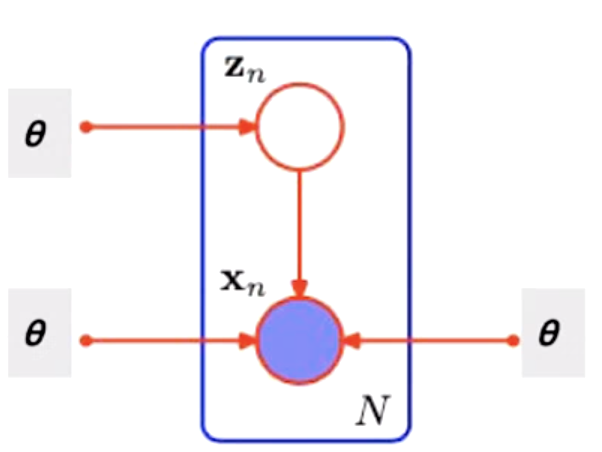

### EM algorithm general

<!--  -->

$X$ observed, $Z$ latent variable; $P(X,Z\mid \theta)$ the joint distribution is given, governed by parameter $\theta$. We want to maximize the data likelihood $P(X\mid \theta)$ w.r.t. $\theta$; 

The E step, take expectation of the complete data likelihood $P(X, Z\mid \theta)$ w.r.t. $Z$:
$$
Q(\theta, \theta^{\text{old}}) = \sum_Z P(Z\mid X, \theta^{\text{old}}) \ln P(X,Z\mid \theta)
$$
The above term can be explained as:
$$
\mathbb{E}_{Z\sim P(Z\mid X, \theta^{\text{old}})}f(X,Z\mid \theta)
$$
where $f(X,Z\mid \theta) = \ln P(X,Z\mid\theta)$ which is the $\ln$ of complete data likelihood (taking $\ln$ is for computation convenience).

We want to maximize the expectation of data likelihood by adjusting the parameter $\theta$, hence the M step:
$$
\theta^{\text{new}} = \arg\max_{\theta} Q(\theta, \theta^{\text{old}})
$$

### Case study: Gaussian Mixture Model

Under construction...